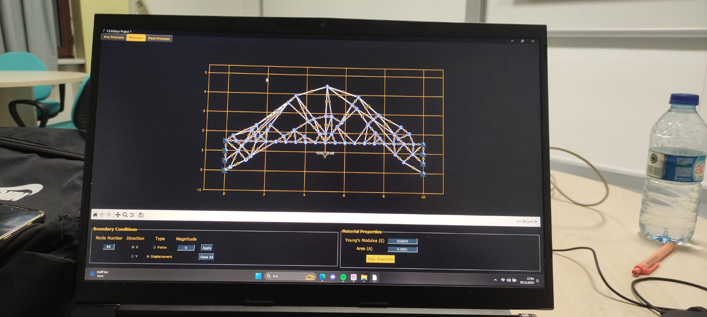
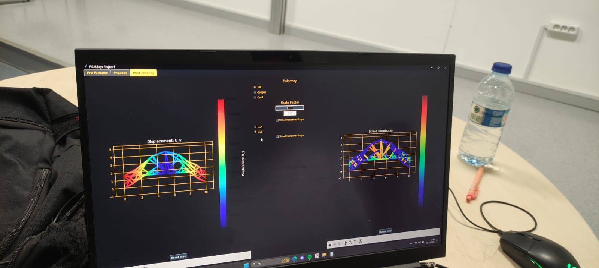
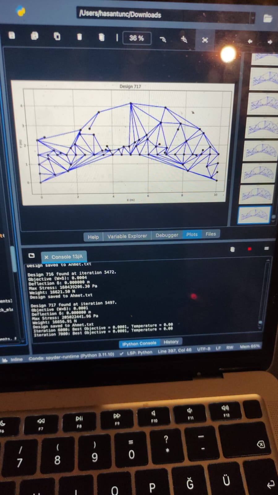

# FEM Bridge Optimizer

A finite element analysis toolkit with AI-powered structural optimization for truss bridge design. Combines classical FEM methods with simulated annealing and genetic algorithms to find optimal bridge configurations.



## Features

**Finite Element Analysis**
- 1D truss elements with arbitrary node placement
- Global stiffness matrix assembly
- Support for multiple boundary conditions
- Stress and displacement computation

**AI Optimization**
- Simulated annealing for global optimization
- Genetic algorithm with crossover and mutation
- Multi-objective optimization (weight + stress + displacement)
- Real-time design evolution visualization

**Interactive GUI**
- Pre-processor for mesh generation
- Boundary condition application
- Post-processor with colormap visualization
- Deformed shape overlay

## Screenshots

| Post-Processing | Optimization Progress |
|:---------------:|:---------------------:|
|  |  |

## Installation

```bash
git clone https://github.com/[YOUR_USERNAME]/FEM-Bridge-Optimizer.git
cd FEM-Bridge-Optimizer
pip install -r requirements.txt
```

## Usage

**GUI Mode:**
```bash
python main.py
```

**Command Line Optimization:**
```bash
python main.py --mode optimize --method simulated_annealing --iterations 5000
```

**Python API:**
```python
from src.optimizer import BridgeOptimizer

optimizer = BridgeOptimizer(width=10, height=5)
best_design, objective = optimizer.simulated_annealing(max_iterations=5000)

print(f"Optimized bridge: {len(best_design['nodes'])} nodes")
print(f"Objective value: {objective:.4f}")
```

## Project Structure

```
FEM-Bridge-Optimizer/
├── main.py              # Entry point
├── requirements.txt     
├── src/
│   ├── __init__.py
│   ├── fem_solver.py    # FEM implementation
│   ├── optimizer.py     # SA and GA algorithms
│   └── gui.py           # Tkinter interface
├── examples/
│   └── sample_bridge.txt
└── screenshots/
```

## Technical Details

**FEM Formulation:**
- Element stiffness: K = (EA/L) × [c²  cs  -c²  -cs; cs  s²  -cs  -s²; ...]
- Global assembly with DOF mapping
- Penalty method for boundary conditions

**Optimization Objective:**
```
f(design) = W/1000 + stress_penalty + displacement_penalty
```
Where penalties activate when constraints are violated.

**Algorithms:**
- Simulated Annealing: Metropolis criterion with exponential cooling
- Genetic Algorithm: Tournament selection, single-point crossover, adaptive mutation

## Example Results

After 5000+ iterations, the optimizer converges to efficient truss configurations:

| Metric | Value |
|--------|-------|
| Max Stress | ~200 MPa |
| Max Displacement | <0.01 m |
| Weight | ~16,000 N |

## Team

- Hüseyin Tunç - Lead Developer
- [Team Member 2] - [Role]
- [Team Member 3] - [Role]
- [Team Member 4] - [Role]

*Developed as part of ME 362 Finite Element Methods course at Bilkent University*

## License

MIT License - See LICENSE file for details.
